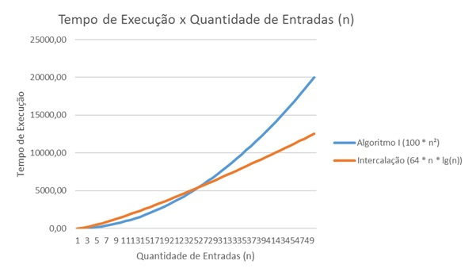
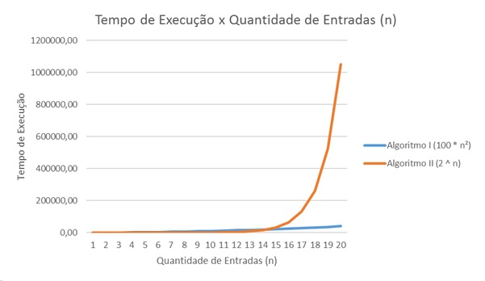

# Exercícios - Capítulo 1

### Exercícios

__1.1-1__ Cite um exemplo real que exija ordenação ou um exemplo real que exija o cálculo de uma envoltória convexa.

* __Ordenação__: Listagem de alunos por nome, sobrenome, nota ou de produtos por nome, código ou fabricante.
* __Envoltória Convexa__: Topografia, determinar o terreno que envolve os pontos levantados, Curvas de nível.

__1.1-2__ Além da velocidade, que outras medidas de eficiência poderiam ser usadas em uma configuração real?

__R__ - Espaço utilizado para solução, custo financeiro dos recursos utilizados, por exemplo: banda de conexão, tempo de processamento.

__1.1-3__ Selecione uma estrutura de dados que você tenha visto antes e discuta seus pontos fortes e suas limitações.

* __Vetor__
	* __Pontos fortes__: Rapidez no acesso aos dados, pondendo ser acessados diretamente através de um índice.
	* __Limitações__: Remoção de um dado intermediário do vetor, causando uma custosa realocação e se utilizado de alocação estática, o seu redimensionamento.

__1.1-4__ Em que aspectos os problemas anteriores do caminho mais curto e do caixeiro-viajante são semelhantes? Em que aspectos eles são diferentes?

* __Semelhantes__: Quando o problema do caixeiro-viajante possui poucos nós sua solução se assemelha ao do caminho mais curto.
* __Diferenças__: Ao inserir mais nós ao problema do caixeiro-viajante a solução se modifica pois não existe nenhum algoritmo conhecido para a sua resolução pois esse é um problema NP Completo.

__1.1-5__ Mostre um problema real no qual apenas a melhor solução servirá. Em seguida, apresente um problema em que baste uma solução que seja "aproximadamente" a melhor.

* __Melhor__: Sistema de controle do ritmo cardíaco de um paciente na UTI de um Hospital.
* __Aproximada__: Encontrar o caminho com menos engarrafamento entre pontos A e B de um GPS.

__1.2-1__ Cite um exemplo de aplicação que exige conteúdo algorítimico no nível da aplicação e discuta a função dos algoritmos envolvidos.

__R__ - Aplicativo para solicitação de um taxista. ex: *99Taxis*, *EasyTaxi*. Onde são utilizados algoritmos para localização do taxista mais próximo que se adeque as suas escolhas.

__1.2-2__ Suponha que estamos comparando implementações de ordenação por inserção e ordenação por intercalação na mesma máquina. Para entradas de tamanho n, a ordenação por inserção é executada em `8n²` passos, enquanto a ordenação executada por intercalação é executada em `64n lg (n)` passos. Para quais valores de `n` a ordenação por inserção supera a ordenação por intercalação?

__R__ - A ordenação por inserção supera a ordenação por intercalação quando a entrada `n` for menor ou igual a 43 registros, como pode ser observado na tabela e gráfico abaixo.

| n      | Inserção (8 * n²) | Intercalação (64 * n * lg(n)) |           |
| ------ | --------          | ----------------              | --------- |
| 23	 | 4232,00	         | 4615,45                       |           |
| 24	 | 4608,00	         | 4881,49                       |           |
| 25	 | 5000,00	         | 5150,20                       |           |
| 26	 | 5408,00	         | 5421,47                       | __MENOR__ |
| 27	 | 5832,00	         | 5695,21                       | __MAIOR__ |
| 28	 | 6272,00	         | 5971,31                       |           |
| 29	 | 6728,00	         | 6249,70                       |           |
| 30	 | 7200,00	         | 6530,30                       |           |

__1.2-3__ Qual é o menor valor de `n` tal que um algoritmo cujo tempo de execução é `100n²` funciona mais rapidamente que um algoritmo cujo tempo de execução é `2ⁿ` na mesma máquina?

__R__ - O Algoritmo I `100n²` só passa a ser executado mais rapidamente que o Algoritmo II `2ⁿ` quando a quantidade de registros se iguala ou ultrapassa 15, como pode ser observado na tabela e gráfica abaixo.

| n	       | Algoritmo I (100 * n²)    | Algoritmo II (2ⁿ)   |                |
| -------- | ------------------------- | ------------------- | -------------- |
| 10	   | 10000,00	               | 1024,00             |                |
| 11	   | 12100,00	               | 2048,00             |                |
| 12	   | 14400,00	               | 4096,00             |                |
| 13	   | 16900,00	               | 8192,00             |                |
| 14	   | 19600,00	               | 16384,00            | __MAIOR__      |
| 15	   | 22500,00	               | 32768,00            | __MENOR__      |
| 16	   | 25600,00	               | 65536,00            |                |
| 17	   | 28900,00	               | 131072,00           |                |
| 18	   | 32400,00	               | 262144,00           |                |
| 19	   | 36100,00	               | 524288,00           |                |
| 20	   | 40000,00	               | 1048576,00          |                |

### Problemas

__1-1__ Comparação entre tempos de execução. 
 
Para cada função `f(n)` e cada tempo `t` na tabela a seguir, determine o maior tamanho `n` de um problema que pode ser resolvido no tempo `t`, considerando que os algoritmos para resolver o problema demore `f(n)` microssegundos.

|                        | 1 segundo | 1 minuto    | 1 hora        | 1 dia           | 1 mês             | 1 ano              | 1 século            |
| ---------              | -----------          | ----------             | --------                 | -------                    | -------                      | -------                       | ----------                     |
| __lg n__    | 2^10⁶	    | 2^6*10⁷	 | 2^36*10⁸	    | 2^864*10⁸	     | 2^2592*10⁹	    | 2^94608*10¹⁰	    | 2^94608*10¹² |
| __sqrt(n)__ | 10¹²	    | 36^10¹⁴	 | 1296^10¹⁶	    | 746496^10¹⁶	 | 6718464^10¹⁸	    | 8950673664^10²⁰	| 8950673664^10²⁴          |
| __n__       | 10⁶	    | 6*10⁷	     | 36*10⁸	    | 864*10⁸	     | 2592*10⁹	        | 94608*10¹⁰	        | 94608*10¹²          |
| __n lg n__  | 62746	    | 2801417	 | 133378058	    | 2755147513	     | 71870856404	    | 797633893349	    | 68654697441062         |
| __n²__      | 1000	    | 7745	     | 60000	        | 293938	         | 1609968	        | 5615692	        | 56175382          |
| __n³__      | 100	    | 391	     | 1532	        | 4420	         | 13736	            | 31593	            | 146677          |
| __2ⁿ__      | 19	    | 25	         | 31	        | 36	             | 41	            | 44	                | 51         |
| __n!__      | 9	        | 11	         | 12	        | 13	             | 15	            | 16	                | 17         |

<!-- ⁰ ¹ ² ³ ⁴ ⁵ ⁶ ⁷ ⁸ ⁹ ⁺ ⁻ ⁼ ⁽ ⁾ ₀ ₁ ₂ ₃ ₄ ₅ ₆ ₇ ₈ ₉ ₊ ₋ ₌ ₍ ₎ ᵃ ᵇ ᶜ ᵈ ᵉ ᶠ ᵍ ʰ ⁱ ʲ ᵏ ˡ ᵐ ⁿ ᵒ ᵖ ʳ ˢ ᵗ ᵘ ᵛ ʷ ˣ ʸ ᶻ -->    